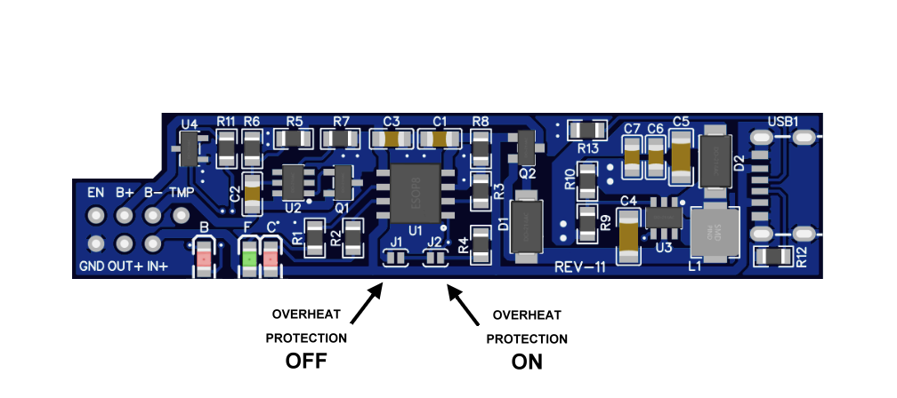
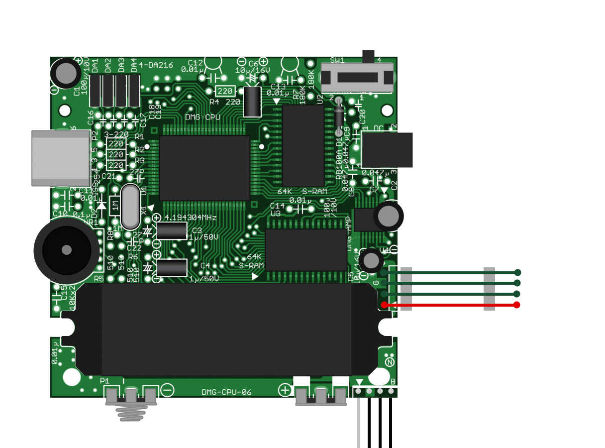
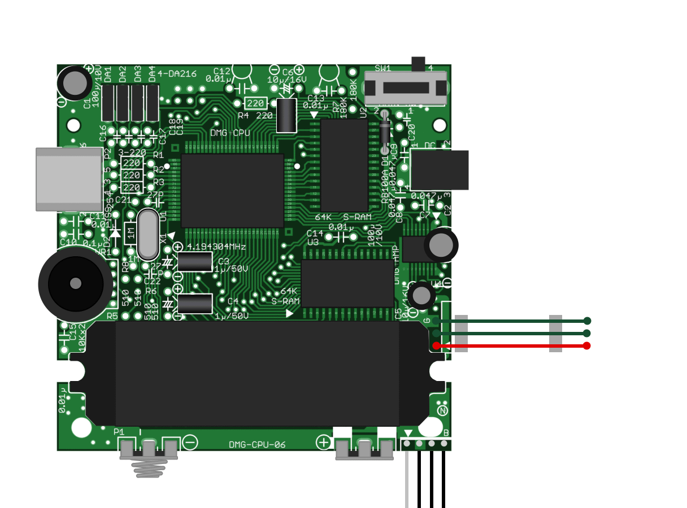
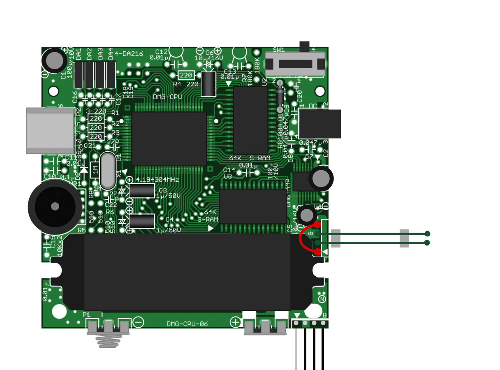
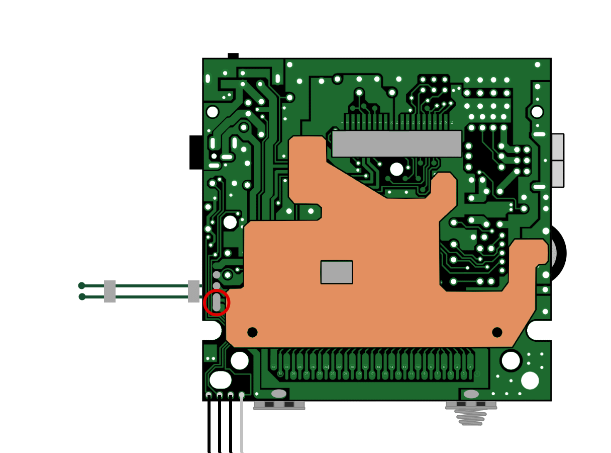
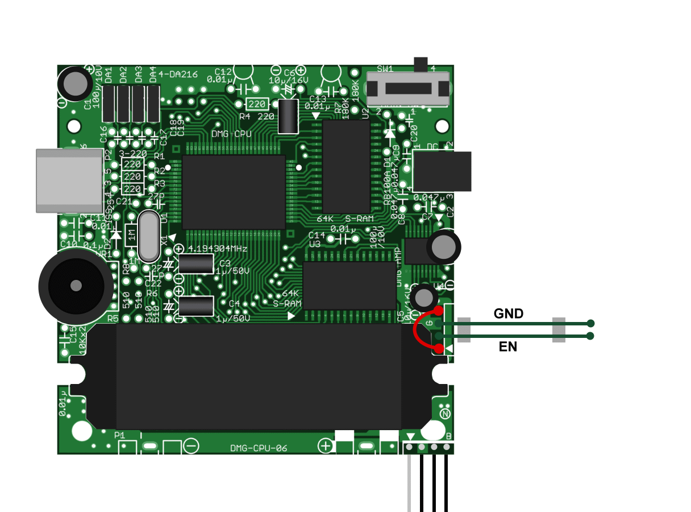
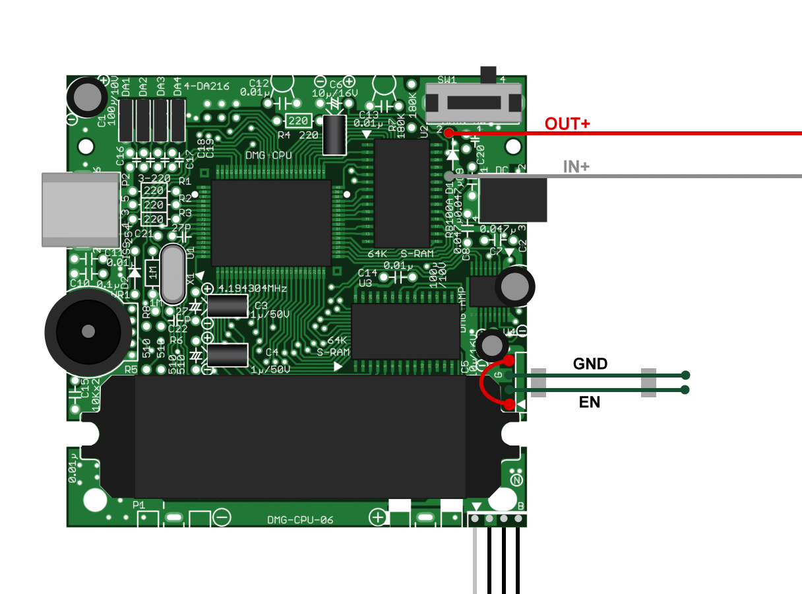
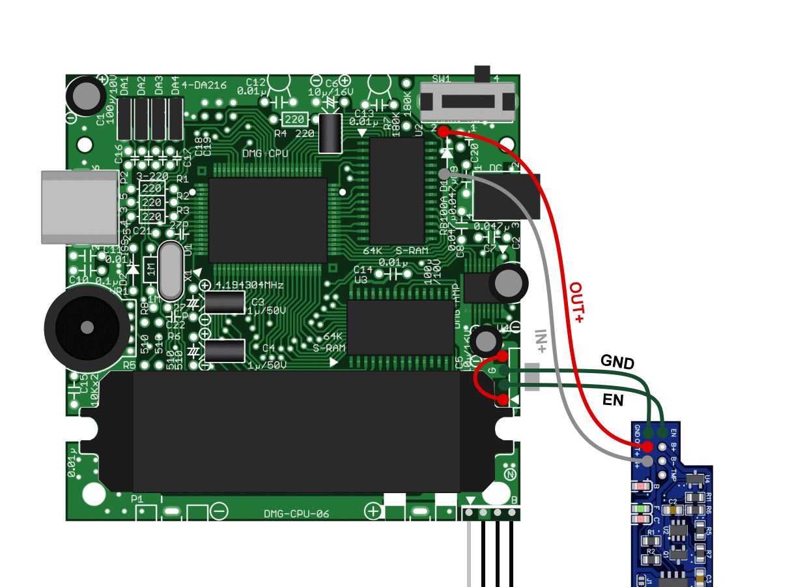
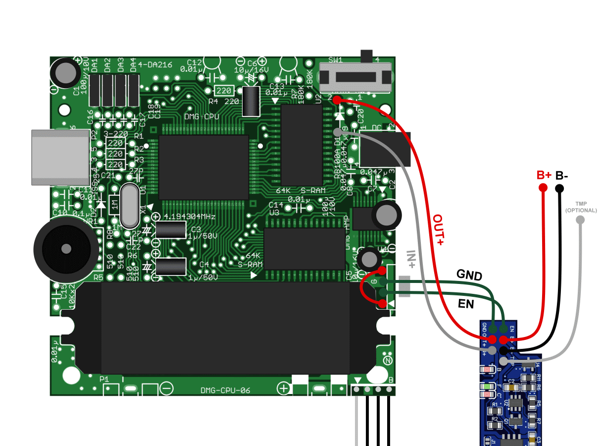

# CHARGER BOY
A custom Li-Po battery charger/regulator PCB for the Nintendo Game Boy DMG-01.

### Features:
- Single cell Li-Po battery charger using a TP4056 IC.
- Uses the Gameboy's DC connector as power input, so you don't have to cut any holes for microUSB ports.
- (Optional) USB Type-C Connector, for those who like carving holes for charging ports.
- Overcharge (4.25v) protection from the TP4056.
- Overdischarge (3.2v), Overcurrent and Short-Circuit protection using a FS312F IC.
- (Optional) Battery overheat protection (only if your battery has a thermistor cable).
- Load sharing: Disconnects the battery from the load while charging, so you can safely play while charging the battery.
- 5.1v power regulator, using a MT3608/SDB628 step-up converter.
- Low battery LED indicator.

### Notes:
- Since this PCB only outputs 5.1v, it's only suitable for being used with IPS-Screen modded units (funnyplaying, RIPS...). It won't work with original "Dot Matrix" displays.

- The shape of the PCB is the same as the original regulator PCB, so it fits in the place of the old regulator.

- Using a 125054 battery is recommended, as it fits perfectly in the DMG battery compartment with no additional modding required.

# PCB CONFIGURATION

Before installation, you must configure the overheat protection by soldering one of the two jumper pads (J1/J2). Note that you must solder a single jumper pad only.
You may use the overheat protection only if your battery has a thermistor (Batteries with a thermistor have a third, white cable).
If your battery does not have a thermistor, you must disable overheat protection for the PCB to work correctly.

- J1: Disable overheat protection (if your battery does not have a thermistor).
- J2: Enable overheat protection (if your battery has a thermistor).
 

# INSTALLATION

## STEP 1:
Desolder the old regulator board from the cables. Keep the cables soldered to the mainboard, as we're going to reuse some of them.
 

## STEP 2:
Desolder the first green cable as shown in the image below. You can discard this cable.
 

## STEP 3:
Connect the red cable to the empty solder point as shown in the image below. You can cut the cable to make it a bit shorter if you need to.
 

## STEP 4:
Solder the two shown points together as shown in the image below.
 

## STEP 5:
Remove the battery contacts from the mainboard in order to make space for routing the battery cables.
 

## STEP 6:
Remove the diode next to the power switch.
 

## STEP 7:
Connect two cables to the (now empty) diode solder points. Leave them at least 13cm/5in long.
 

## STEP 8:
Connect the four cables to the Charger Boy PCB as shown in the image below. You can cut the IN+ and OUT+ cables to make them a bit shorter if you need to. Just keep them long enough so you can comfortably fit everything back in the case.
 

## STEP 9:
Solder additional cables to connect the battery (B+, B-). The third cable (TMP) is optional, you only need it if your battery has a thermistor cable and you have previously enabled the battery overheat protection.
 

## STEP 10:
To be continued...
