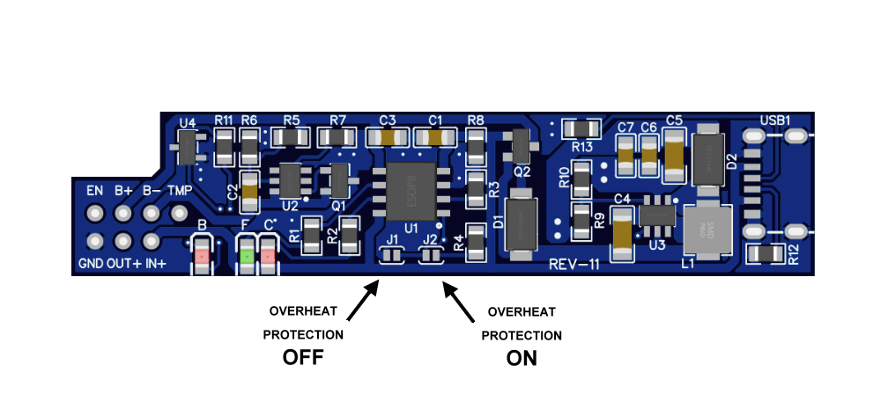
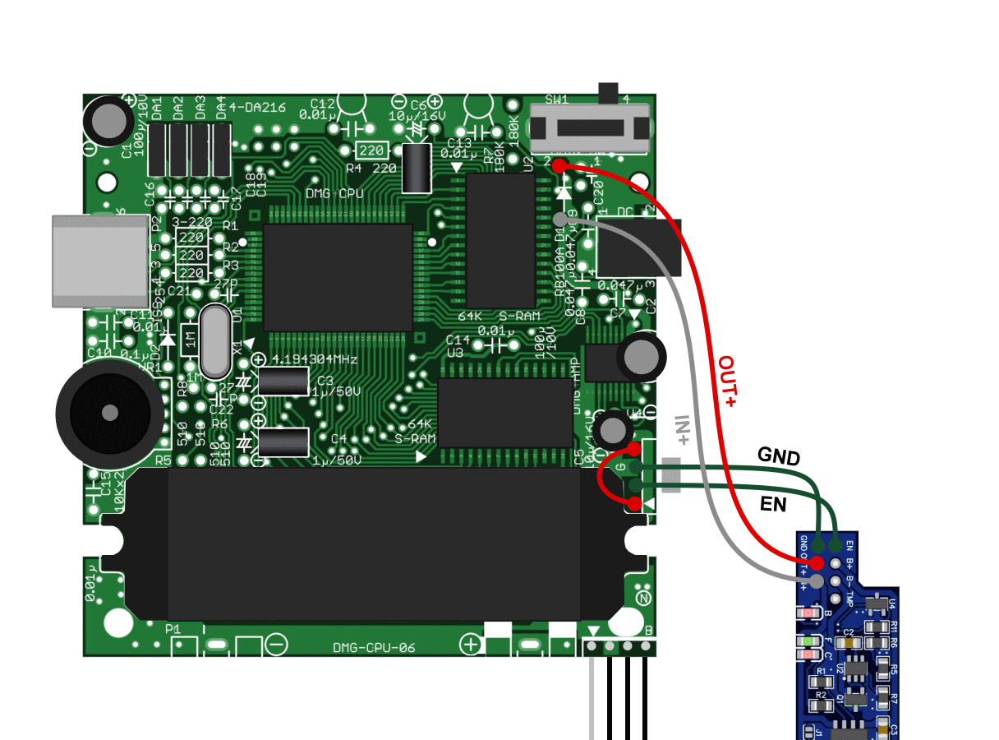

 
 
### A custom Li-Po battery charger/regulator PCB for the Nintendo Game Boy DMG-01.

### Features:
- Single cell Li-Po battery charger (0.78A) using a TP4056 IC.
- Uses the Gameboy's DC connector as power input, so you don't have to cut any holes for microUSB ports.
- (Optional) USB Type-C Connector, for those who like carving holes for charging ports.
- Overcharge (4.25v) protection from the TP4056.
- Overdischarge (3.2v), Overcurrent and Short-Circuit protection using a FS312F-G IC.
- (Optional) Battery overheat protection (only if your battery has a thermistor cable).
- Load sharing: Disconnects the battery from the load while charging, so you can safely play while charging the battery.
- 5.1v power regulator, using a MT3608/SDB628 step-up converter.
- Low battery LED indicator.

### Notes:
- Since this PCB only outputs 5.1v, it's only suitable for being used with IPS-Screen modded units (funnyplaying, RIPS, Hispeedido...). It won't work with original "Dot Matrix" displays.

- This PCB is meant to replace the old regulator. It has been designed to fit tightly in the regulator slot so the PCB doesn't wiggle.

- Using a 125054 battery is recommended, as it fits perfectly in the DMG battery compartment with no additional modding required.

# SCHEMATIC
 

# FILES
You can find the PCB files <a href="https://github.com/hi-ban/charger-boy/tree/main/charger-boy-1/files">HERE:</a>

# ORDERING THE PCB
### IMPORTANT: When ordering the PCB, make sure the PCB thickness is 1.2mm
### Also, if you order from JLCPCB, make sure you select "Specify a Location" in the "Remove order number" field.
### See image below:
 
- If you plan to order SMT assembly service for the PCB, please take into account that some components may not be available for the SMT assembly service.
- Also, one or more components might be out of stock. You might have to select an equivalent component, if available. If not, you will have to find and solder the missing parts by yourself.

# BOM
- All the resistors and the LEDs are 0805. All the capacitors are also 0805 except for the 22uF ones, which are 1206.
- As before, note that one or more components might be out of stock at LCSC.
- If you're populating the PCB by yourself, you can get the LEDs and any missing components from other component providers or from aliexpress. I found the LEDs from aliexpress to be brighter than the "basic part" ones from LCSC.
- Also, you might want to use a BLINKING LED for the low battery indicator, which you can find in aliexpress and ebay (i've been unable to find those in LCSC).

 
### IMPORTANT: Some parts included in the BOM are only required for optional features, so you might not need to buy them:
### R4 is only needed for the overheat protection feature. If your battery does not have a thermistor, you can skip this component.
### R12, R13 and USB1 are only needed if you're using the optional USB-C connector. If you're not using it, you can skip this components.

# PCB ASSEMBLY
- Using a stencil to apply the solder paste and a hot plate to solder the components is recommended. You will save a lot of time and effort this way.
- **Don't mount the USB-C connector if you're not going to use it. The PCB with it mounted will not fit inside the case unless you carve a hole for it to stick out.**

# PCB CONFIGURATION

Before installation, you must configure the overheat protection feature by soldering one of the two jumper pads (J1/J2). Note that you must solder a single jumper pad only.
You may use the overheat protection only if your battery has a thermistor (Batteries with a thermistor have a third, white cable).
If your battery does not have a thermistor, you must disable overheat protection for the PCB to work correctly.

- J1: Disable overheat protection (if your battery does not have a thermistor).
- J2: Enable overheat protection (if your battery has a thermistor).
 

# PCB INSTALLATION

## STEP 1:
Desolder the old regulator board from the cables. Keep the cables soldered to the mainboard, as we're going to reuse some of them.
 

## STEP 2:
Desolder the first green cable as shown in the image below. You can discard this cable.
 

## STEP 3:
Connect the red cable to the empty solder point as shown in the image below. You can cut the cable to make it a bit shorter if you need to.
 

## STEP 4:
Solder the two shown points together as in the image below.
 

## STEP 5:
Remove the battery contacts from the mainboard in order to make space for fitting the battery and routing the battery cables.
 

## STEP 6:
Remove the diode next to the power switch.
 

## STEP 7:
Connect two cables to the (now empty) diode solder points. Leave them at least 13cm/5in long.
 

## STEP 8:
Connect the four cables to the Charger Boy PCB as shown in the image below. You can cut the IN+ and OUT+ cables to make them a bit shorter if you need to. Just keep them long enough so you can comfortably fit everything back in the case.
 

## STEP 9:
Solder additional cables to connect the battery (B+, B-). The third cable (TMP) is optional, you only need it if your battery has a thermistor and you have previously enabled the battery overheat protection (see <a href="https://github.com/hi-ban/charger-boy/blob/main/README.md#pcb-configuration">PCB CONFIGURATION</a>). 
 

# COMPATIBILITY WITH CUSTOM CPU PCBs

You can use the Charger Boy with other custom CPU PCBs, such as <a href="https://github.com/kamicane/Super-DMG-01">Kamicane's Super-DMG-01</a> or <a href="https://github.com/MouseBiteLabs/Game-Boy-DMG-Color">MouseBiteLabs DMG-Color</a>.
Below are the connection diagrams for them:
### Super DMG-01 PCB:
 
### DMG Color PCB:
 

# LED HOLES

If your Game Boy case is not transparent, you may want to drill two holes for the light from the LED indicators to be visible.
I drilled two 2mm holes in the case, and used two small pieces of 2mm-diameter optical fiber as light pipes.
See the image below:

 

# BATTERY CONNECTION

I used a 2mm PH connector and it seems to be the largest one which fits. But you can also use a 1.5mm ZH connector, or just splice the cables.
I recommend using a connector so you can easily disconnect the battery.
See the images below:

 

# CHARGING CABLE

### IMPORTANT: Make sure your USB to DC-Jack cable has the appropiate polarity. Otherwise, the PCB could be permanently damaged!
The appropiate polarity is indicated in the Game Boy case, next to the charging port. See images below:
 
 

Nintendo used reversed polarity compared to the standard USB to DC-Jack cables, so if you get a generic USB to DC-Jack cable you will most likely have to mod it to reverse the polarity. It's a simple task, just cut the cable and reconnect the two poles reversing their initial position.

As an alternative, you can buy specific USB to Gameboy-DC cables from some modding stores.

Whatever option you choose, **make sure to always check the polarity before using a new cable.**
