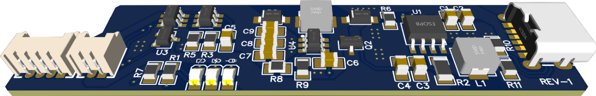

 
 
### A custom Li-Po battery charger/regulator PCB for the Nintendo Game Boy DMG-01.

### Features:
- Single cell Li-Po battery charger (2A) using a SLM6500 IC.
- Uses the Gameboy's DC connector as power input, so you don't have to cut any holes for microUSB ports.
- (Optional) USB Type-C Connector, for those who like carving holes for charging ports.
- Overcharge (4.28v), Overdischarge (3.0v), Overcurrent and Short-Circuit protection using a PT8261 IC.
- Load sharing: Disconnects the battery from the load while charging, so you can safely play while charging the battery.
- 5.1v power regulator, using a MT3608/SDB628 step-up converter.
- Low battery LED indicator.

### Notes:
- Since this PCB only outputs 5.1v, it's only suitable for being used with IPS-Screen modded units (funnyplaying, RIPS...). It won't work with original "Dot Matrix" displays.

- This PCB is meant to replace the old regulator. It has been designed to fit tightly in the regulator slot so the PCB doesn't wiggle.

- Using a 125054 battery is recommended, as it fits perfectly in the DMG battery compartment with no additional modding required.

### COMING SOON...
